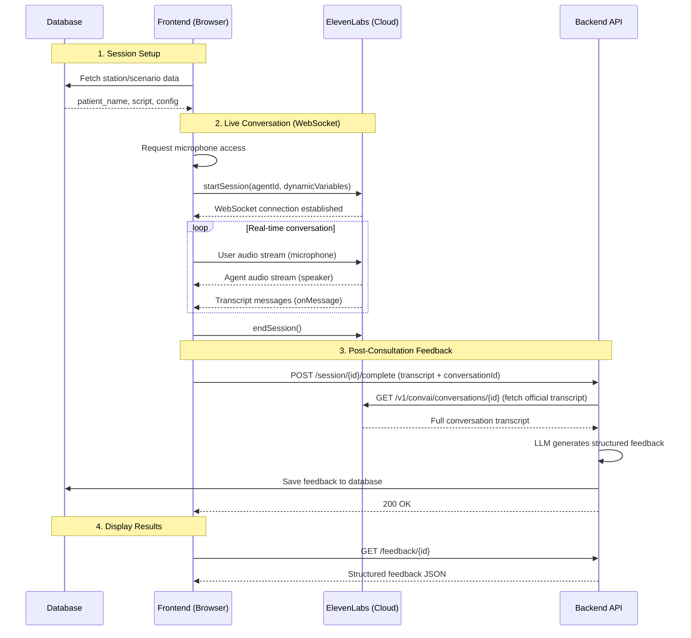
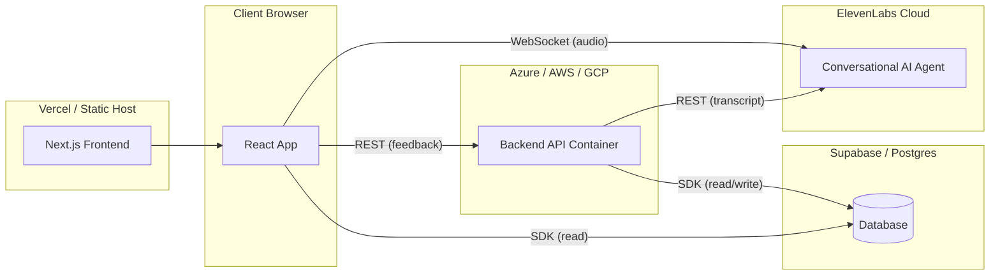

# ElevenLabs Conversational AI — Architecture Guide

A reference architecture for integrating ElevenLabs Conversational AI with a web frontend and backend feedback pipeline.

---

## High-Level Architecture



---

## Component Breakdown

### 1. ElevenLabs Agent (Cloud-Hosted)

The AI agent lives entirely on ElevenLabs' servers. Configuration is done via the [ElevenLabs Dashboard](https://elevenlabs.io/app/conversational-ai) or API.

**What you configure:**
- **System Prompt** — The agent's personality and behaviour rules
- **Voice** — Which ElevenLabs voice to use
- **Dynamic Variables** — Placeholders in the prompt (e.g. `{{patient_name}}`, `{{station_script}}`) that get injected at runtime from the frontend
- **Tools** — Custom server-side tools the agent can call during conversation (e.g. `request_examination`, `get_investigation_result`)
- **LLM** — Which model powers the agent (e.g. GPT-4, Gemini)

**What you get:**
- An `agent_id` (e.g. `agent_abc123xyz`)
- A WebSocket endpoint: `wss://api.elevenlabs.io/v1/convai/conversation?agent_id=...`
- REST API for retrieving conversation transcripts after the fact

> [!IMPORTANT]
> The agent's system prompt is **not stored in your codebase**. It lives on ElevenLabs' servers. Keep a local copy in documentation for reference.

---

### 2. Frontend Integration (React/Next.js)

**Package:** `@elevenlabs/react` (wraps `@elevenlabs/client`)

#### Custom Hook Pattern

The recommended pattern is a custom hook that wraps `useConversation` from the ElevenLabs React SDK:

```typescript
import { useConversation } from '@elevenlabs/react';

export function useAgentSession({ agentId, dynamicVariables, onConnect, onDisconnect, onError }) {
    const [transcript, setTranscript] = useState([]);

    const conversation = useConversation({
        onConnect:    () => { /* agent connected */ },
        onDisconnect: () => { /* agent disconnected */ },
        onMessage:    (msg) => {
            // msg.source = 'user' | 'ai'
            // msg.message = the spoken text
            setTranscript(prev => [...prev, {
                role: msg.source === 'user' ? 'user' : 'assistant',
                content: msg.message,
                timestamp: new Date().toISOString(),
            }]);
        },
        onError: (err) => { /* handle connection errors */ },
    });

    const connect = async () => {
        await navigator.mediaDevices.getUserMedia({ audio: true });
        const conversationId = await conversation.startSession({
            agentId,
            dynamicVariables,   // injected into {{placeholders}} in the prompt
        });
    };

    return {
        connect,
        endSession:  () => conversation.endSession(),
        isConnected: conversation.status === 'connected',
        isSpeaking:  conversation.isSpeaking,  // true when agent is speaking
        transcript,
    };
}
```

#### Page Component Flow

```
Page Mount → Fetch scenario data from DB → Pass to hook as dynamicVariables
                                          → Auto-connect when data loads
                                          → Display live transcript + audio waveform
                                          → Timer expires or user clicks "End"
                                          → endSession() + POST to backend
                                          → Navigate to feedback page
```

#### Key Environment Variables (Frontend)

| Variable | Purpose |
|----------|---------|
| `NEXT_PUBLIC_ELEVENLABS_AGENT_ID` | The agent ID from ElevenLabs dashboard |
| `NEXT_PUBLIC_BACKEND_URL` | Your backend API URL (for feedback) |

---

### 3. Backend API (FastAPI / Any REST Framework)

The backend has **no involvement during the live conversation**. It only runs after the conversation ends.

#### Endpoints

| Method | Path | Purpose |
|--------|------|---------|
| `POST` | `/session/{id}/complete` | Accept transcript, generate feedback, save to DB |
| `GET`  | `/feedback/{id}` | Return saved feedback for a session |
| `GET`  | `/health` | Health check |

#### POST `/session/{id}/complete` Flow

```
1. Receive { conversation_id, station_id, transcript[] }
2. Optionally fetch official transcript from ElevenLabs API:
   GET https://api.elevenlabs.io/v1/convai/conversations/{conversation_id}
   Headers: xi-api-key: <ELEVENLABS_API_KEY>
3. Fetch scenario metadata from DB (marking criteria, station data)
4. Build a prompt with transcript + marking criteria
5. Call LLM (GPT-4, etc.) to generate structured feedback
6. Save feedback to DB
7. Return 200
```

#### Key Environment Variables (Backend)

| Variable | Purpose |
|----------|---------|
| `ELEVENLABS_API_KEY` | For fetching conversation transcripts from ElevenLabs API |
| `ELEVENLABS_AGENT_ID` | Agent identifier (for API calls) |
| `LLM API keys` | For feedback generation (e.g. Azure OpenAI, OpenAI) |
| `DATABASE_URL / keys` | For reading scenario data and saving feedback |

---

### 4. Database Schema (Minimal)

```sql
-- Scenarios / Stations
CREATE TABLE stations (
    id          UUID PRIMARY KEY,
    title       TEXT,
    patient_name TEXT,
    patient_age  INT,
    station_script TEXT,           -- injected as {{station_script}} into agent
    candidate_instructions TEXT,   -- shown to user before consultation
    marking_criteria JSONB,        -- passed to feedback LLM
    duration_seconds INT DEFAULT 120,
    is_active   BOOLEAN DEFAULT true
);

-- Sessions
CREATE TABLE sessions (
    id          UUID PRIMARY KEY,
    station_id  UUID REFERENCES stations(id),
    user_id     UUID,
    status      TEXT DEFAULT 'active',  -- active | completed
    conversation_id TEXT,               -- ElevenLabs conversation ID
    transcript  JSONB,                  -- [{role, content, timestamp}]
    feedback    JSONB,                  -- structured feedback from LLM
    created_at  TIMESTAMPTZ DEFAULT now()
);
```

---

## Data Flow Summary

| Phase | Who Talks to Whom | Protocol |
|-------|------------------|----------|
| **Setup** | Frontend → Database | REST / Supabase SDK |
| **Conversation** | Frontend ↔ ElevenLabs | WebSocket (audio + text) |
| **Feedback** | Frontend → Backend → ElevenLabs API → LLM → Database | REST + HTTP |
| **Results** | Frontend → Backend → Database | REST |

> [!TIP]
> The backend **never handles real-time audio**. ElevenLabs manages all voice synthesis, speech recognition, and conversation state. Your backend only processes the text transcript after the fact.

---

## Dynamic Variables

Dynamic variables let you use **one agent configuration** for many different scenarios.

**In the ElevenLabs system prompt:**
```
You are {{patient_name}}, a {{patient_age}} year old patient.
Follow this script: {{station_script}}
```

**Injected at runtime from the frontend:**
```typescript
conversation.startSession({
    agentId: 'agent_abc123',
    dynamicVariables: {
        patient_name: 'Margaret Thompson',
        patient_age: '58',
        station_script: 'You have been experiencing chest pain for 3 days...',
    },
});
```

This avoids creating separate ElevenLabs agents for each scenario.

---

## Deployment Topology



| Component | Hosting | Scaling |
|-----------|---------|---------|
| Frontend | Vercel / Netlify / static host | Edge / CDN |
| ElevenLabs Agent | ElevenLabs Cloud (managed) | Automatic |
| Backend API | Container (ACA, Cloud Run, ECS) | 0 → N replicas |
| Database | Supabase / managed Postgres | Managed |

---

## Cost Considerations

| Resource | When Charged | Metric |
|----------|-------------|--------|
| ElevenLabs | During live conversations | Minutes of audio |
| LLM (feedback) | Per feedback generation | Input/output tokens |
| Backend hosting | When running | vCPU-seconds (scale to 0 = free when idle) |
| Database | Always | Storage + egress |
